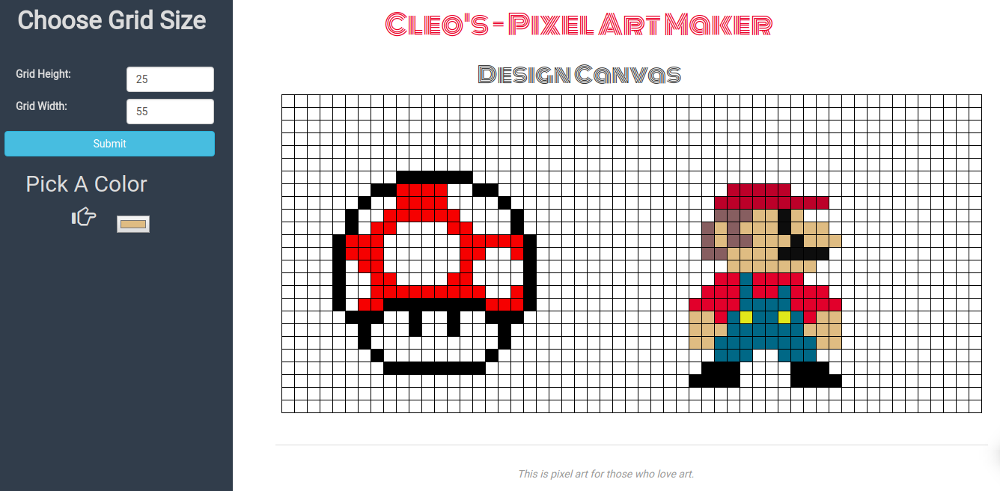

# Pixel Art Maker Project

***my project for the google Africa scholarship challenge***

 

 ### Instructions for using the pixel canvas:

 1. Choose the grid height and width which you want to work with.
 1. Then hit the submit button.
 1. Choose the desired color from the color picker.
 1. Enjoy the art work.
 
 *I recomend you use Minimum **Grid width** of 55 and Minimum **Grid height** of 27 to produce the best pixel art outlook*